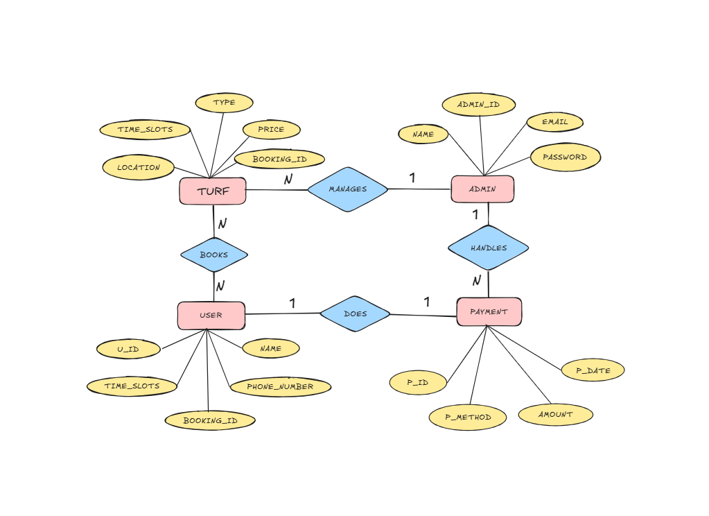

BookMyTurf – Your Turf, Your Time
BookMyTurf is a smart and user-friendly turf booking platform built with React and Firebase.
It simplifies ground reservations for players and turf managers with real-time slot booking,
dynamic pricing, and secure login — all with a clean interface and zero backend coding.
Features
User Sign Up & Login with Firebase Authentication

Book Turf by Time Slot with real-time availability

Choose Game Type: Football, Cricket, or Other

Dynamic pricing with morning discounts

Personalized booking history per user

Firebase Firestore used as the database

Fully responsive UI with Tailwind CSS

Tech Stack
Frontend
Backend-as-a-Service
Styling
Deployment
React JS
Firebase Auth + Firestore
Tailwind CSS
Firebase Hosting / Vercel

ER Representation

Link to ER: https://excalidraw.com/#room=3e01616fb76685379844,itMhZhDt34950j8cs-gTxg

How to Run Locally
bash
CopyEdit
git clone https://github.com/brijwanitina/TurfBooking.git
cd BookMyTurf
npm install
npm run start

Firebase Setup Steps
Go to firebase.google.com

Create a new project → Add web app

Enable:

Email/Password in Authentication

Firestore Database

Copy the config and paste into firebase.js

What We Learned
Built a functional full-stack app using Firebase

Solved real-world problems like slot conflicts and user history

Improved user experience with responsive design

Learned how to use Firebase Authentication and Firestore together

Team
Tina Brijwani,Palak Lund,Siya Rohra,Gungun Narwani

Wrap-up
BookMyTurf makes turf reservations smooth, modern, and mobile-friendly. Whether you're a player looking for a quick game or a manager trying to prevent overbookings, our solution delivers simplicity and efficiency — all in one place.